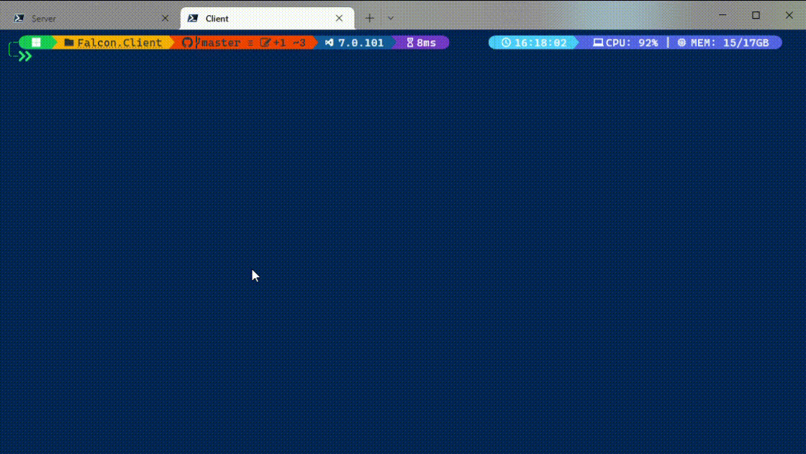

# Falcon 🐦

Terminal/PowerShell chat application.



## Description 🧾

Falcon is terminal chat app built on .NET platform. It contains 2 projects for backend and client that are comunicating by REST API and SingalR. Client uses [Terminal.Gui](https://github.com/gui-cs/Terminal.Gui) for TUI.

## Get started 🚀

### Develop localy 💻

To develop falcon app first clone this repository using git:

```bash
git clone https://github.com/MaciekWin3/Falcon
cd Falcon
dotnet restore
```

After downloading project you will need to setup postgresql database and update `appsettings.json` in both projects.

### Setup database 💾

> This part of tutorial will be using [Supabase](https://supabase.com/) as postgresql database provider

Falcon requires postgresql datbase for stroing users and messages. After database is created you need to update appsettings.json files. In server project under ConnectionStrings:FalconDB put your connection string that you acquired from Supabase. After that you need to setup Entity Framework with these command:

```bash
dotnet ef database update
```

## Setup Server with Azure ☁

The easiest way to host your falcon server is to use Azure services. To do this you need to open Visual Studio and click on Falcon.Server project and choose option Publish. Then follow the configurator and select all services as shown in the attached screenshots. In the described case, I chose the option of manually publishing the application. Once setup is complete, publish the app. After a few minutes, you should be able to view the applications at the URL indicated in Visual Studio and try to log in with the application. If you manage to log in, you have successfully configured the Falcon Server app. If you have already set up the database and updated configs, run both projects (client and server) with and check if you can login. If you are being redirected to lobby window, then congratulations you successfuly seted up Falcon Application 🎉

## Setup users account 🤠

For now Falcon does not have dashboard to create new users so you have to do this with postman. Use this url `[app_url]/api/auth/register` (replace [app_url] with your app url) and paste this code body section:

```json
{
  "username": "[username]",
  "password": "[password]"
}
```

Remember to replace [username] with users username and [password] with users password.

## Download client app 💬

> App is still in development and only way that you can use app is to setup development enviroment locally

To connect to server download falcon client app from nuget ussing this command from your terminal:

```bash
dotnet tool install ...
```

For this command to work you must have the latest .NET version installed on your machine.

## Contribute 🤝

Contributions to project are welcome!

## License 📕

This project is licensed MIT

## Author 📝

Maciej Winnik
